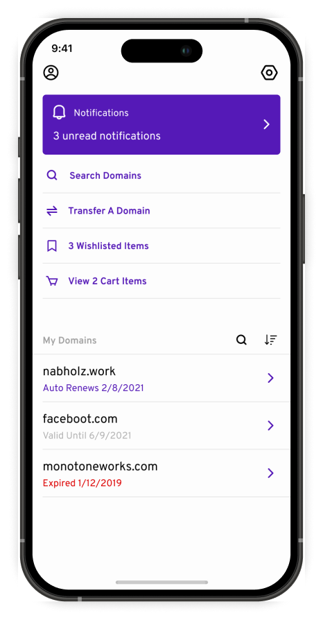
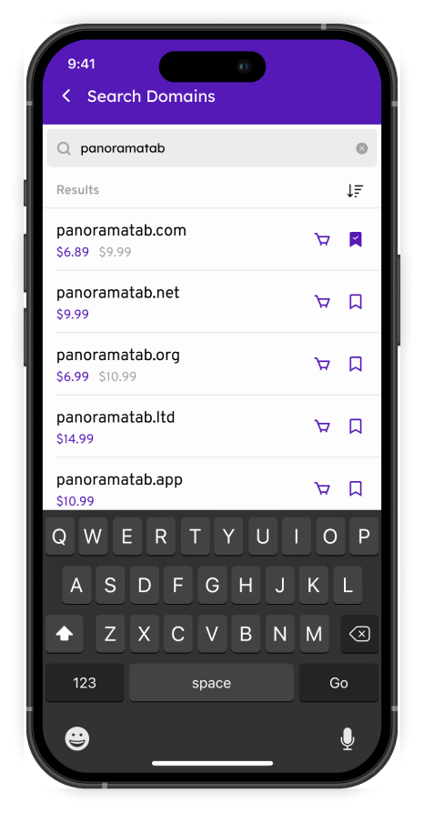
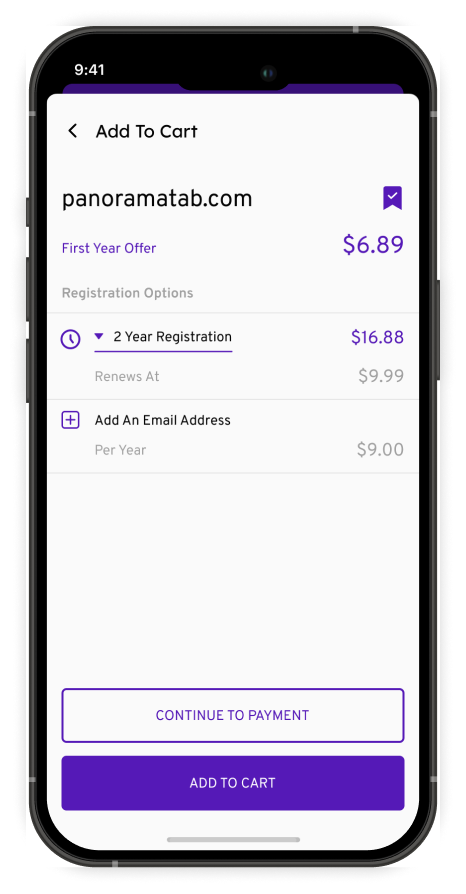

Domain management on mobile can turn into a frustrating experience.

Constantly needing to switch to desktop to complete different tasks like updating DNS records, renewing or purchasing new domains or upgrades like custom email addresses, extra security and more.

I worked on a native mobile app that puts all essential domain management tools at users' fingertips.

The app prioritizes speed and simplicity, allowing users to have more control over their domains while on mobile.

## Quick Access Dashboard

The homepage provides instant access to all key functions:

- Search for new domains
- Transfer of existing domains
- View wishlisted domains
- Manage shopping cart
- Overview of registered domains
- Notifications for wishlisted items or other information about your domains

Everything is one tap away.

## Smart Domain Search

Search results show:

- Real-time availability
- Current discounts
- Save-for-later option
- Intelligent recommendations

Users can quickly compare options and make decisions on the spot

## Key features

- **Push notifications:** Renewal reminders and status updates
- **One-tap actions:** Common tasks require minimal steps
- **Advanced options:** View and update advanced options directly from the app
- **Secure authentication:** Biometric login support
- **Offline capability:** View domain info without internet

The design eliminates the need for desktop access for 90% of domain management tasks, making domain management more accessible to mobile-first users and improving overall user satisfaction.
