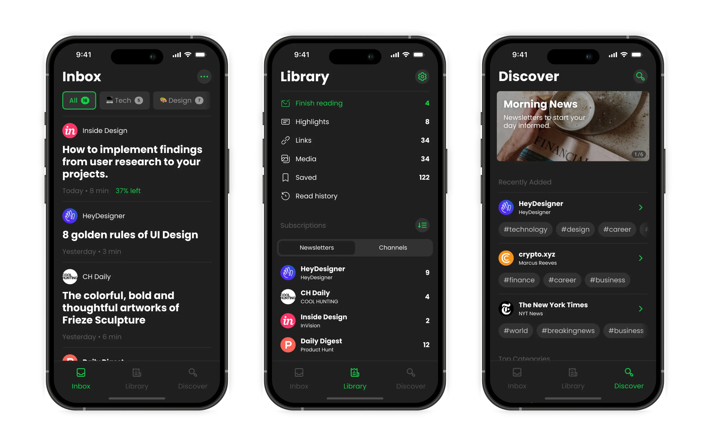
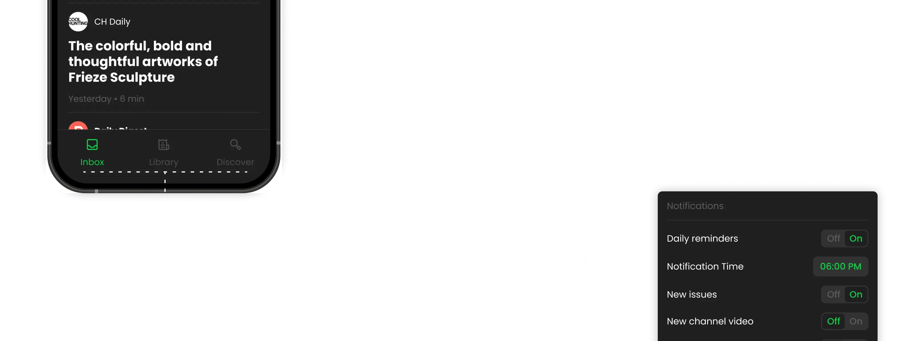
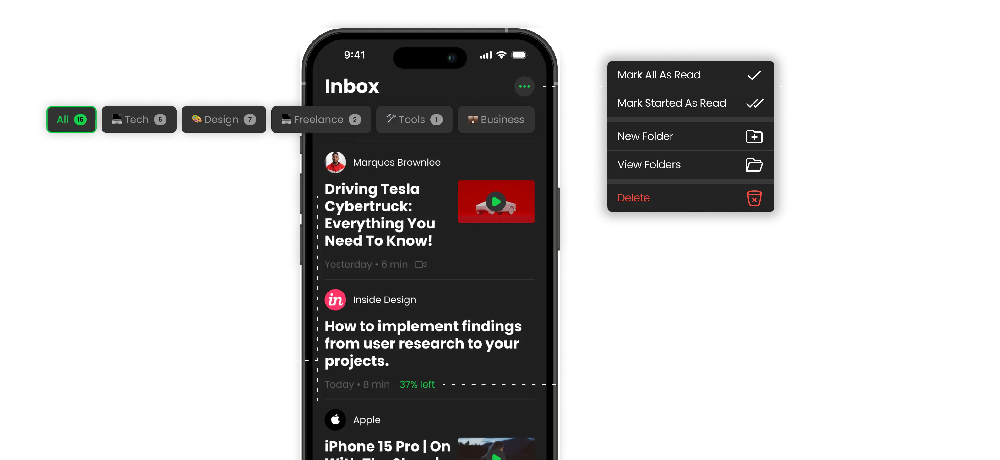
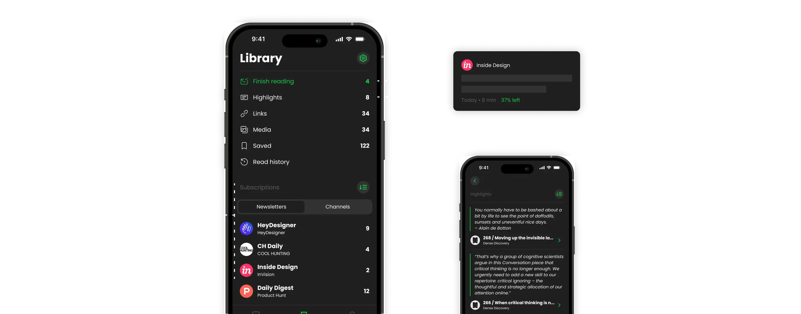
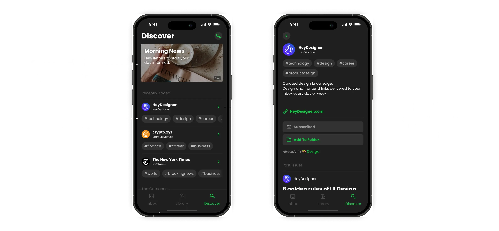
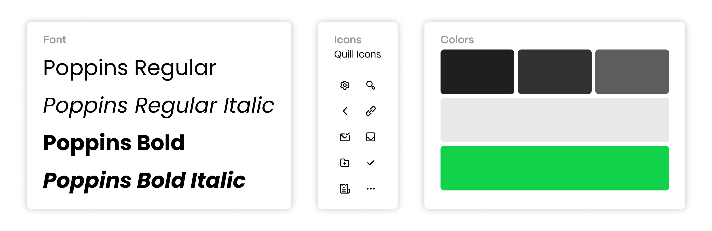

Stoop Inbox is a service that gives you a custom email address for newsletters and subscriptions. It's designed to keep your main email clean while giving you a better reading experience than regular email apps.

## Problems

After looking at user reviews and comparing it to similar apps, the problems were pretty clear:

- **Too much clutter:** The same buttons and menus showed up duplicated in different places of the app, this felt like a "quick patch" solution to other issues like having menus hidden and the single screen design decision
- **Hidden features:** Useful actions like creating and managing folders and muting newsletters or channels were buried in menus
- **Outdated look:** The design felt old and disconnected
- **Basic notifications:** You couldn't customize when or how you got alerts

The app had potential, but it wasn't meeting users' needs.

## Research and Planning

I looked at popular email apps and newsletter services to see what worked well.
The best apps had:

- Smart notification controls (schedule quiet hours, customize by folder)
- Easy organization tools
- Clean, focused reading experience
- Features that actually saved people time

## Redesign

I redesigned the app around four main areas that would make the biggest difference for users.

### Better Inbox Experience

The inbox is where people spend most of their time, so it needed to be clean and fast.

I focused on making it easy to scan through new content and quickly decide what to read now vs. later.

### New Library Feature

This was the biggest addition. Instead of just reading and forgetting, users could now save and organize the good stuff:

- **Finish Reading:** Issues you started but didn't finish
- **Highlights:** Save quotes or important text from articles
- **Saved Issues:** Full articles you want to keep
- **Links & Media:** Collect useful links, images, and videos
- **Reading History:** Track what you've read

### Discovery That Actually Works

Finding new newsletters was a pain in the old app. The new discovery section makes it easy to:

- Browse by categories or search specific tags
- See what's popular and trending
- Get basic info about newsletters before subscribing
- Add new subscriptions directly to organized folders

### Reading Experience

This is what the whole app is about - making reading enjoyable. I studied how people actually read on mobile and designed around those patterns:

- Clean typography that's easy on the eyes
- Smart text sizing and spacing
- Quick actions for saving and sharing
- Distraction-free mode for longer articles

### Customization Options

Everyone reads differently, so the app needed adapt.

Users can now:

- Choose from different reading themes
- Adjust text size and spacing
- Set notification preferences
- Organize content their way

## Results

The redesign addressed the main pain points while adding features that made the app genuinely useful for daily reading. Users could finally organize their newsletters, find new content easily, and actually enjoy the reading experience.

The key was keeping things simple while adding power where it mattered most - in organization, discovery, and reading.
